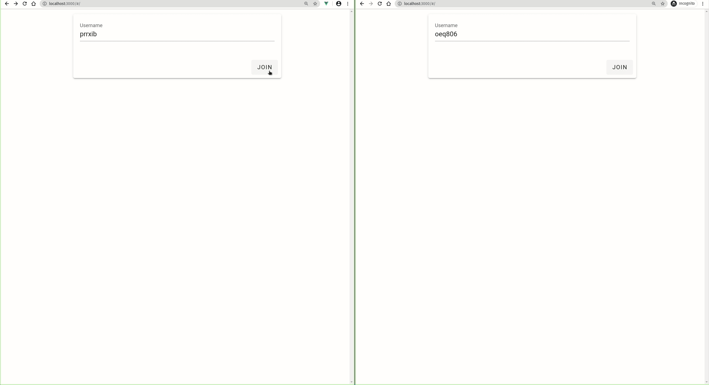

# Rethink Chat App

## Giới thiệu

Đây là một ứng dụng nhắn tin trực tuyến nhằm demo khả năng server push của RethinkDB.

Với cơ sở dữ liệu truyền thống, để phát hiện thay đổi trong cơ sở dữ liệu, server sẽ cần thực hiện polling liên tục để cập nhật trạng thái. Thao tác này không hiệu quả và làm lãng phí tài nguyên của server. Ngược lại, người dùng có thể đặt listener cho một số câu query của RethinkDB. Khi có sự thay đổi, RethinkDB sẽ chủ động push dữ liệu mới tới server để server xử lý.



## Cấu trúc cơ sở dữ liệu

Cơ sở dữ liệu cho ứng dụng có 3 bảng chính:

- Bảng users: Chứa thông tin người dùng.
- Bảng rooms: Chứa thông tin các phòng chat.
- Bảng messages: Chứa các tin nhắn trong phòng chat.

Bảng users

```json
{
  "id": "4c86c9b8-af4c-4b21-b829-4126ebf3003e",
  "name": "tj2krm"
}
```

Bảng rooms

```json
{
  "createdAt": "Tue Nov 17 2020 03:14:00 GMT+00:00",
  "id": "37d9acf0-bda1-4e4b-9c34-db8a93141433",
  "name": "Group 2"
}
```

Bảng messages

```json
{
  "content": "Hy",
  "id": "3c1d3f10-f32f-44d8-85ce-1027153ecde5",
  "roomId": "2601d45e-623f-402a-b7d9-1774816fb297",
  "senderId": "7b9e7697-eb39-49ff-83d5-ff900ab3bf2e",
  "ts": "2020-11-20T13:56:56.474Z"
}
```

## Hướng dẫn sử dụng

Cài đặt RethinkDB

```sh
source /etc/lsb-release && echo "deb https://download.rethinkdb.com/repository/ubuntu-$DISTRIB_CODENAME $DISTRIB_CODENAME main" | sudo tee /etc/apt/sources.list.d/rethinkdb.list
wget -qO- https://download.rethinkdb.com/repository/raw/pubkey.gpg | sudo apt-key add -
sudo apt-get update
sudo apt-get install rethinkdb
```

Chạy RethinkDB Server và truy cập vào RethinkDB Administration Console tại http://localhost:8080

```sh
cd && rethinkdb
```

Sử dụng RethinkDB Administration Console, tạo cơ sở dữ liệu và các bảng cần thiết.

```js
r.dbCreate("chats");
r.db("chats").tableCreate("users");
r.db("chats").tableCreate("rooms");
r.db("chats").tableCreate("messages");
r.db("chats").table("messages").indexCreate("roomId");
```

Chạy NodeJS Server và truy cập http://localhost:3000

```sh
yarn install && yarn run start:dev
```
